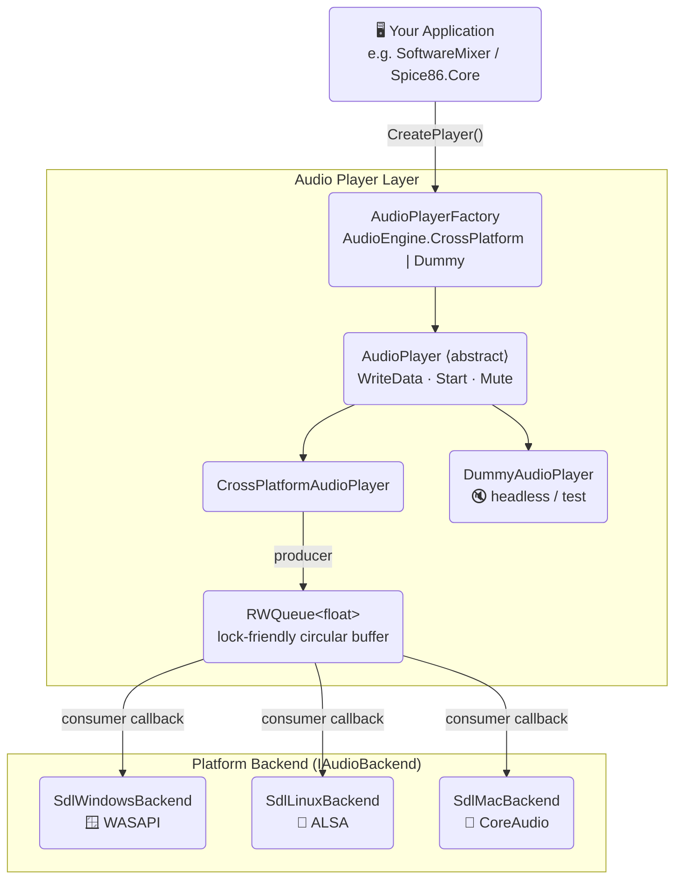
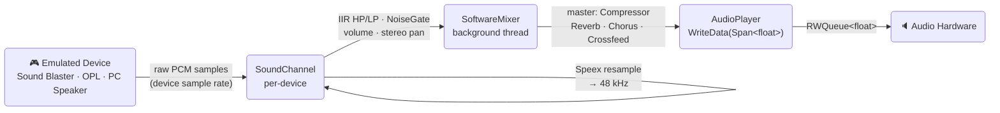
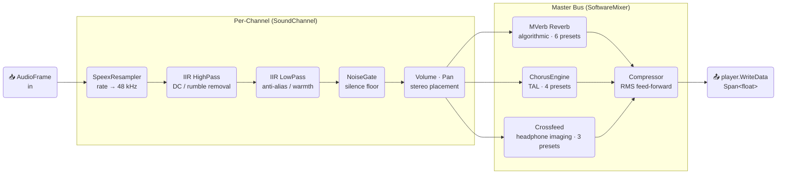

# Spice86.Audio

> **Cross-platform, fully-managed C# audio library for real-time PCM output and DOS-era audio emulation.**

[](https://www.nuget.org/packages/Spice86.Audio)
[](https://github.com/OpenRakis/Spice86.Audio/actions/workflows/pr.yml)
[](LICENSE)
[](https://dotnet.microsoft.com/)
[](https://github.com/OpenRakis/Spice86.Audio)

---

## Overview

`Spice86.Audio` is the audio subsystem extracted from [Spice86](https://github.com/OpenRakis/Spice86), a DOS program emulator. It provides everything needed to render and output real-time PCM audio on Windows, Linux, and macOS — without any native binary dependencies.

The library is a faithful C# port of the audio pipeline used by [DOSBox Staging](https://github.com/dosbox-staging/dosbox-staging) and [SDL2](https://www.libsdl.org/), adapted for modern .NET. It is used by `Spice86.Core` to support emulated audio devices — Sound Blaster, OPL2, OPL3, Adlib Gold, PC Speaker, and more.

> [!NOTE]
> `Spice86.Audio` targets `net10.0`. No native runtime packages, bundled `.dll`, `.so`, or `.dylib` files are required — all system API interop is done directly in C# via `LibraryImport` / P/Invoke.

**Key properties:**

| Feature | Detail |
|---|---|
| 🟢 100% managed C# | No bundled native binaries |
| 🔊 Callback-driven output | WASAPI · ALSA · CoreAudio |
| 🔒 Thread-safe queue | `RWQueue<T>` — lock-friendly circular buffer |
| 🎛️ Rich filter chain | Compressor · Reverb · Chorus · Noise gate · Crossfeed · IIR · Speex |
| 🔇 Graceful fallback | `DummyAudioPlayer` when no audio device is available |

---

## Table of Contents

1. [Architecture](#architecture)
2. [Signal Flow](#signal-flow)
3. [Filter Chain](#filter-chain)
4. [Installation](#installation)
5. [Quick Start](#quick-start)
6. [API Reference](#api-reference)
   - [Core primitives](#core-primitives)
   - [Audio player](#audio-player)
   - [Thread-safe queue](#thread-safe-queue)
   - [Filters & effects](#filters--effects)
   - [Mixer state](#mixer-state)
7. [How-Tos](#how-tos)
8. [Platform Support](#platform-support)
9. [Building and Testing](#building-and-testing)
10. [License and Credits](#license-and-credits)

---

## Architecture

The following diagram shows the top-level component layout.



> [!TIP]
> `AudioPlayerFactory` automatically selects the right backend for the current OS. Passing `AudioEngine.Dummy` forces silent output, which is useful for unit tests and CI environments without audio hardware.

---

## Signal Flow

This diagram shows the end-to-end path from an emulated device to the audio hardware.



---

## Filter Chain

`Spice86.Audio.Filters` provides a composable set of DSP building blocks. Each filter is stateful and processes one `AudioFrame` (stereo float32 pair) at a time.



---

## Installation

```bash
dotnet add package Spice86.Audio
```

Targets `net10.0`. No native runtime packages required.

---

## Quick Start

```csharp
using Spice86.Audio;
using Spice86.Audio.Backend;

// 1. Create the player (auto-detects OS backend)
var factory = new AudioPlayerFactory(AudioEngine.CrossPlatform);
AudioPlayer player = factory.CreatePlayer(
    sampleRate: 48000,
    framesPerBuffer: 1024,   // device buffer size (0 = default 1024)
    prebufferMs: 25,          // extra latency cushion
    allowNegotiate: false);   // disallow driver buffer negotiation

// 2. Start the callback loop
player.Start();

// 3. Push interleaved stereo float32 PCM (blocks until queue has space)
Span<float> pcm = stackalloc float[2048]; // 1024 stereo frames
FillAudioData(pcm);
player.WriteData(pcm);

// 4. Control output
player.MuteOutput();
player.UnmuteOutput();

// 5. Flush and release
player.ClearQueuedData();
player.Dispose();
```

> [!IMPORTANT]
> `WriteData` blocks the calling thread when the internal `RWQueue<float>` is full. Call it from a dedicated mixer thread, not from the audio callback or UI thread.

---

## API Reference

### Core primitives

| Type | Namespace | Description |
|---|---|---|
| `AudioFrame` | `Spice86.Audio.Common` | Stereo sample pair `(float Left, float Right)`. Supports `+`, `*`, indexer. |
| `AudioFrameBuffer` | `Spice86.Audio.Filters` | Resizable array of `AudioFrame` values with `Add`, `AddRange`, `AsSpan`, `RemoveRange`. |
| `SampleFormat` | `Spice86.Audio.Backend.Audio` | `UnsignedPcm8`, `SignedPcm16`, `IeeeFloat32`. |
| `AudioFormat` | `Spice86.Audio.Backend.Audio` | Record: `SampleRate`, `Channels`, `SampleFormat`. |

---

### Audio player

| Type | Description |
|---|---|
| `AudioEngine` | Enum: `CrossPlatform` (default) or `Dummy` (silent). |
| `AudioPlayerFactory` | Creates an `AudioPlayer` for the chosen engine. |
| `AudioPlayer` | Abstract base: `WriteData(Span<float>)`, `Start()`, `ClearQueuedData()`, `MuteOutput()`, `UnmuteOutput()`. |
| `CrossPlatformAudioPlayer` | Callback-based player backed by an `IAudioBackend`. Uses `RWQueue<float>` for lock-friendly producer/consumer handoff. |
| `DummyAudioPlayer` | No-op player for headless / test scenarios. |

#### `AudioPlayerFactory.CreatePlayer`

```csharp
AudioPlayer CreatePlayer(
    int sampleRate,       // Hz — e.g. 48000
    int framesPerBuffer,  // device buffer size; 0 → default (1024)
    int prebufferMs,      // extra latency cushion in ms (e.g. 25)
    bool allowNegotiate)  // let the OS driver adjust buffer size
```

Falls back to `DummyAudioPlayer` if the native backend cannot be opened.

---

### Thread-safe queue

`RWQueue<T>` (namespace `Spice86.Audio.Backend`) is a fixed-capacity lock-free-friendly circular buffer designed for the producer/consumer split between the mixer thread and the audio callback.

| Member | Description |
|---|---|
| `BulkEnqueue(Span<T>)` | **Blocking** — waits until space is available. |
| `NonblockingBulkEnqueue(Span<T>)` | Returns immediately; may enqueue fewer items than requested. |
| `BulkDequeue(Span<T>, int)` | Drains up to the requested count; fills remainder with silence on underrun. |
| `Clear()` | Empties the queue and unblocks waiting producer threads. |
| `Stop()` | Signals shutdown; unblocks all waiters permanently. |
| `Size`, `MaxCapacity`, `IsFull`, `IsEmpty` | Introspection properties. |

> [!WARNING]
> Always call `Stop()` (or `Dispose()` on the player) before joining the producer thread, otherwise `BulkEnqueue` may block forever.

---

### Filters & effects

All filter types live in `Spice86.Audio.Filters`.

#### Compressor

RMS-based feed-forward compressor (port of Thomas Scott Stillwell's "Master Tom Compressor"):

```csharp
var compressor = new Compressor();
compressor.Configure(
    sampleRateHz:      48000,
    zeroDbfsSampleValue: (float)short.MaxValue,
    thresholdDb:       -6.0f,
    ratio:             3.0f,
    attackTimeMs:      5.0f,
    releaseTimeMs:     50.0f,
    rmsWindowMs:       5.0f);

AudioFrame output = compressor.Process(inputFrame);
```

#### Noise gate

Mutes the signal below a configurable threshold with configurable attack/release:

```csharp
var gate = new NoiseGate();
gate.Configure(
    sampleRateHz:      48000,
    db0fsSampleValue:  (float)short.MaxValue,
    thresholdDb:       -60.0f,
    attackTimeMs:      1.0f,
    releaseTimeMs:     20.0f);

AudioFrame output = gate.Process(inputFrame);
```

#### Chorus (TAL-NoiseMaker / DOSBox Staging port)

Dual chorus engine — left and right lines processed independently for a wide stereo effect:

```csharp
var chorus = new ChorusEngine(sampleRate: 48000f);
chorus.SetEnablesChorus(isChorus1Enabled: true, isChorus2Enabled: false);

float left = ..., right = ...;
chorus.Process(ref left, ref right);
```

| Preset | Effect |
|---|---|
| `ChorusPreset.None` | Bypass |
| `ChorusPreset.Light` | Subtle ensemble |
| `ChorusPreset.Normal` | Classic chorus |
| `ChorusPreset.Strong` | Wide, lush |

#### Reverb (MVerb)

Professional algorithmic reverb, modelled after DOSBox Staging's MVerb integration:

```csharp
var reverb = new MVerb();
reverb.SetSampleRate(48000);
// configure wet/dry mix, room size, etc. via MVerb properties
```

| Preset | Room size |
|---|---|
| `ReverbPreset.None` | Dry |
| `ReverbPreset.Tiny` | Closet |
| `ReverbPreset.Small` | Small room |
| `ReverbPreset.Medium` | Mid hall |
| `ReverbPreset.Large` | Concert hall |
| `ReverbPreset.Huge` | Cathedral |

#### Crossfeed

Blends a fraction of the left channel into the right and vice-versa for natural headphone imaging:

| Preset | Blend |
|---|---|
| `CrossfeedPreset.None` | 0% — pure stereo |
| `CrossfeedPreset.Light` | 20% |
| `CrossfeedPreset.Normal` | 40% |
| `CrossfeedPreset.Strong` | 60% |

#### IIR filters (Butterworth, Chebyshev I/II, RBJ)

Port of [iir1](https://github.com/berndporr/iir1) by Vinnie Falco and Bernd Porr:

```csharp
using Spice86.Audio.Filters.IirFilters.Filters.Butterworth;

// High-pass: remove DC and low rumble
var hp = new HighPass();
hp.Setup(order: 2, sampleRate: 48000f, cutoffHz: 200f);
float filtered = hp.Filter(sample);

// Low-pass: anti-alias / warmth
var lp = new LowPass();
lp.Setup(order: 2, sampleRate: 48000f, cutoffHz: 4000f);
```

Available filter families: `Butterworth`, `ChebyshevI`, `ChebyshevII`, `RBJ`. Each provides `LowPass`, `HighPass`, `BandPass`, `BandStop`, and shelf variants (`LowShelf`, `HighShelf`, `BandShelf`). The `RBJ` family additionally includes `AllPass`, `IirNotch`, and a second `BandPass` mode.

#### Speex resampler

High-quality resampler ported from libspeex (used internally by `SoundChannel`):

```csharp
using Spice86.Audio.Filters.Speex;

var resampler = new SpeexResamplerCSharp(
    channels: 2,
    inRate:   22050,
    outRate:  48000,
    quality:  5);     // 0 (fastest) … 10 (best)
```

| `ResampleMethod` | Description |
|---|---|
| `Resample` | Full Speex sinc resampler (default) |
| `LerpUpsampleOrResample` | Linear interpolation for upsampling, Speex otherwise |
| `ZeroOrderHoldAndResample` | Sample-and-hold (vintage DAC style) |

---

### Mixer state

`MixerState` is an enum that describes the current audio output state:

| Value | Description |
|---|---|
| `NoSound` | Audio device not initialized or explicitly disabled. |
| `On` | Audio device active and mixing. |
| `Muted` | Device active but producing silence (e.g. emulator paused). |

---

## How-Tos

### Play a sine wave

```csharp
using Spice86.Audio;
using Spice86.Audio.Backend;

const int sampleRate = 48000;
const int framesPerBuffer = 1024;

var factory = new AudioPlayerFactory(AudioEngine.CrossPlatform);
using AudioPlayer player = factory.CreatePlayer(sampleRate, framesPerBuffer, 25, false);
player.Start();

var buffer = new float[framesPerBuffer * 2]; // stereo interleaved
double phase = 0;
const double frequency = 440.0; // A4
const double step = 2 * Math.PI * frequency / sampleRate; // radians per sample

while (true)
{
    for (int i = 0; i < framesPerBuffer; i++)
    {
        float sample = (float)Math.Sin(phase);
        buffer[i * 2]     = sample; // L
        buffer[i * 2 + 1] = sample; // R
        phase = (phase + step) % (2 * Math.PI);
    }
    player.WriteData(buffer);
}
```

### Apply reverb and chorus to a channel

```csharp
using Spice86.Audio.Filters;

var reverb = new MVerb();
reverb.SetSampleRate(48000);
// Set the medium preset by applying the corresponding property values
// (see MVerb.cs for property names matching each ReverbPreset)

var chorus = new ChorusEngine(48000f);
chorus.SetEnablesChorus(true, true);

// Process one stereo frame
AudioFrame dry = new AudioFrame(left: 0.5f, right: 0.5f);

float l = dry.Left, r = dry.Right;
chorus.Process(ref l, ref r);
AudioFrame wet = new AudioFrame(l, r);
// MVerb processes in-place — see MVerb.Process() overloads
```

### Use `DummyAudioPlayer` in unit tests

```csharp
var factory = new AudioPlayerFactory(AudioEngine.Dummy);
using AudioPlayer player = factory.CreatePlayer(48000, 1024, 0, false);
player.Start();

Span<float> data = stackalloc float[2048];
player.WriteData(data); // never blocks — discards data immediately
```

### Build a custom filter pipeline

```csharp
using Spice86.Audio.Filters;
using Spice86.Audio.Filters.IirFilters.Filters.Butterworth;
using Spice86.Audio.Common;

const int sampleRate = 48000;

var highPass = new HighPass();
highPass.Setup(order: 2, sampleRate, 80f);   // order 2 = 12 dB/octave slope; remove sub-bass rumble

var gate = new NoiseGate();
gate.Configure(sampleRate, (float)short.MaxValue, -60f, 1f, 20f);

var compressor = new Compressor();
compressor.Configure(sampleRate, (float)short.MaxValue, -6f, 3f, 5f, 50f, 5f);

// Per-frame processing
AudioFrame Process(AudioFrame input)
{
    float l = highPass.Filter(input.Left);
    float r = highPass.Filter(input.Right);
    var gated = gate.Process(new AudioFrame(l, r));
    return compressor.Process(gated);
}
```

---

## Platform Support

| Platform | Backend class | Native API | Notes |
|---|---|---|---|
| 🪟 Windows | `SdlWindowsBackend` | **WASAPI** (COM interop) | Available on all modern Windows versions |
| 🐧 Linux | `SdlLinuxBackend` | **ALSA** (`libasound`) | Uses the system ALSA library |
| 🍎 macOS | `SdlMacBackend` | **CoreAudio** AudioQueue | Works on Intel and Apple Silicon |
| ☁️ Any / CI | `DummyAudioPlayer` | None | Automatic fallback when no device is found |

All native interop is implemented directly in C# using `LibraryImport` / P/Invoke. No bundled `.so`, `.dll`, or `.dylib` files are included.

---

## Building and Testing

```bash
# Build the library
dotnet build src/Spice86.Audio.slnx --configuration Release

# Run tests
dotnet test tests/Spice86.Audio.Tests
```

> [!NOTE]
> CI runs automatically on all three platforms (Windows, Linux, macOS) on every pull request and on every push to `main`.

---

## License and Credits

The `Spice86.Audio` library itself is licensed under the [Apache License 2.0](LICENSE).

It incorporates C# ports of the following third-party components:

### SDL (Simple DirectMedia Layer)
- **License:** [zlib License](LICENSE.SDL)
- The cross-platform audio backend (WASAPI/ALSA/CoreAudio) is a faithful port of SDL2's audio subsystem. SDL's callback model is preserved exactly: the audio hardware drives timing, and the application fills buffers on demand.
- Full thanks to the SDL team for their outstanding cross-platform multimedia library.

### DOSBox Staging
- **License:** [GNU GPL v2.0](LICENSE.DOSBOXSTAGING)
- The mixer architecture, `RWQueue<T>`, `AudioFrame`, chorus engine (TAL-NoiseMaker integration), noise gate, MVerb reverb, compressor, and resampling pipeline are all faithful ports of DOSBox Staging's audio subsystem (`src/audio/`, `src/utils/rwqueue.*`).
- Full thanks to the DOSBox Staging team and the original DOSBox team.

### IIR Filters (iir1)
- **License:** MIT / GPL v3 (see [`src/Spice86.Audio/Filters/IirFilters/LICENSE`](src/Spice86.Audio/Filters/IirFilters/LICENSE))
- Port of [iir1](https://github.com/berndporr/iir1) by Vinnie Falco (original DSPFilters) and Bernd Porr.

### Speex Resampler (libspeex)
- **License:** BSD-style (see libspeex source headers)
- Port of the Speex resampler by Jean-Marc Valin and the Speex project.

### TAL-NoiseMaker (Chorus & DCBlock)
- **License:** [GNU GPL v2.0](https://www.gnu.org/licenses/gpl-2.0.html)
- `ChorusEngine`, `Chorus`, `DCBlock`, and `Lfo` ported from TAL-NoiseMaker by Patrick Kunz (Togu Audio Line, Inc.).

### Master Tom Compressor
- **License:** BSD-style (see `Compressor.cs` header)
- `Compressor` is a port of Thomas Scott Stillwell's "Master Tom Compressor" JSFX effect.

### Additional contributors
Work from Patrick Kunz, Martin Eastwood, and John Novak has also been ported. See individual source file headers for details.

Please see the respective LICENSE files at the root of this repository for the full license texts.
